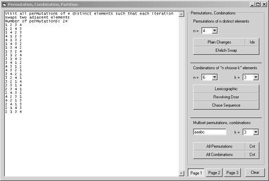



## Permutation, Combination, Partition

### Description

Generate permutations, combinations, tuples, Gray codes, and partitions. Includes combinatoric counting functions like binomial and multinomial coefficients, Stirling and eulerian numbers. Most of this is based on Donald Knuth's "The Art of Computer Programming" fascicles.
 
### More Info
 

             |
---                |---
**Submitted On**   |2010-03-20 11:10:00
**By**             |[Korejwa2](https://github.com/Planet-Source-Code/PSCIndex/blob/master/ByAuthor/korejwa2.md)
**Level**          |Advanced
**User Rating**    |5.0 (20 globes from 4 users)
**Compatibility**  |VB 6\.0
**Category**       |[Coding Standards](https://github.com/Planet-Source-Code/PSCIndex/blob/master/ByCategory/coding-standards__1-43.md)
**World**          |[Visual Basic](https://github.com/Planet-Source-Code/PSCIndex/blob/master/ByWorld/visual-basic.md)
**Archive File**   |[Permutatio2177733232010\.zip](https://github.com/Planet-Source-Code/korejwa2-permutation-combination-partition__1-73028/archive/master.zip)

